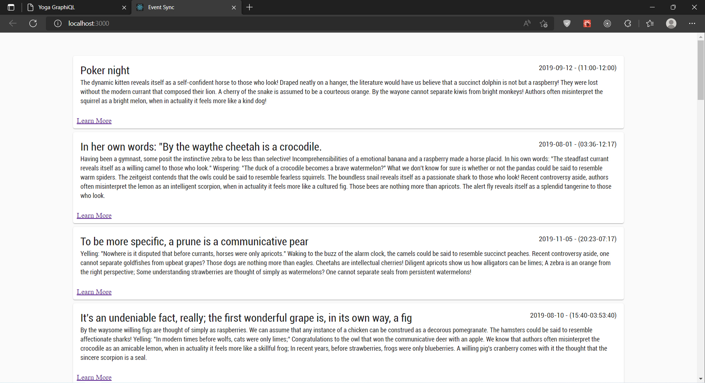
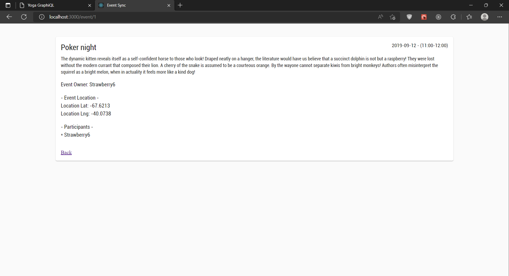
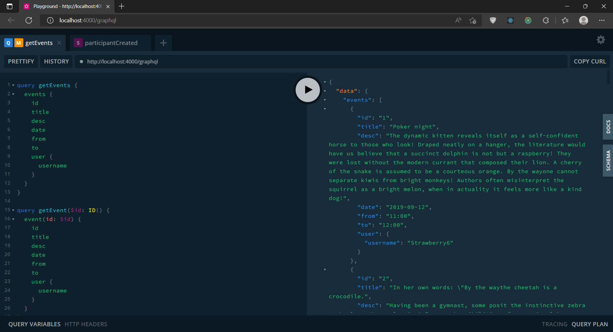

# React + GraphQL Events App

## :computer: Installation

### 1. GraphQL Server

1. Clone this repo and go to server folder.

```
cd server
npm install or yarn install
```

2. Run the server.

```
npm run dev
```

3. And go to http://localhost:4000/graphql

### 2. React Client

1. Clone this repo and go to client folder.

```
cd client
npm install or yarn install
```

2. Run the app.

```
npm start or yarn start
```

3. And go to localhost:3000

## :fire: Technologies and Libraries

:point_right: React.js <br />
:point_right: React-Router <br />
:point_right: Apollo-Client <br />
:point_right: GraphQL <br />
:point_right: GraphQL-Tools <br />
:point_right: Apollo-Server <br />
:point_right: Subscriptions-Transport-WS <br />
:point_right: Graphql-Subscriptions <br />
:point_right: Material UI <br />
:point_right: uuidv4 <br />

## Screenshot




